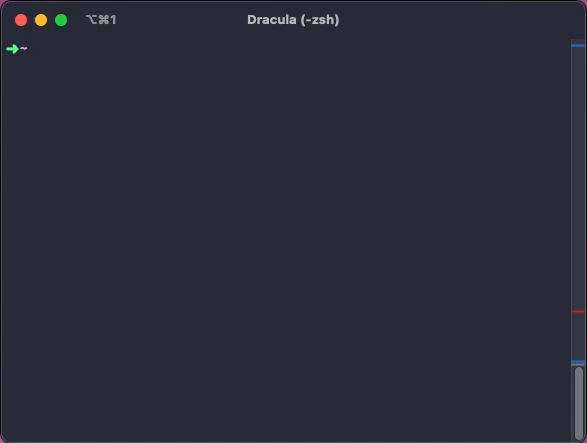

# progress-bar

[](https://github.com/elulcao/progress-bar/blob/main/.github/workflows/go.yaml)
[](https://github.com/elulcao/progress-bar/blob/main/.github/workflows/codeql-analysis.yaml)

---

<p
    align="center">
    
</p>

---

Another simple progress bar, but with a package installer flavor. The progress bar displays the
progress like the well known package manager. This version adapts well to the windows size, small
or big window size the progress bar will adapt to the change; the progress bar will adapt to the
window size automatically.

Last line of the window is preserved to show the progress, the rest of the window is used to show
the program output that consumes the `progress-bar`.

Characters used by default are "#" and "." but can be changed by updating the struct:

```go
type pBar struct {
    //...
    DoneStr    = "#"
    OngoingStr = "."
    //...
}
```

## Usage

The `progress-bar.go` should be modified to your needs, currently implementation is limited to
printing numbers from 1 to 100. In a real world scenario, the `count` variable should be used to
be updated by another routine in your code.

```go
 for count := 1; count <= pBar.Total; count++ {
    pBar.renderPBar(count)
    time.Sleep(time.Second)    // sleep for 1 second
    fmt.Println(count)         // Update here to your needs
 }
```

## Notes

The `progress-bar` has to handler, `syscall.SIGWINCH` and `syscall.SIGTERM`, the first one is used
to detect the window size change and the second one is used to detect the program termination.
These handlers can be removed if not needed, your driver code should be able to handle the
interruptions.
